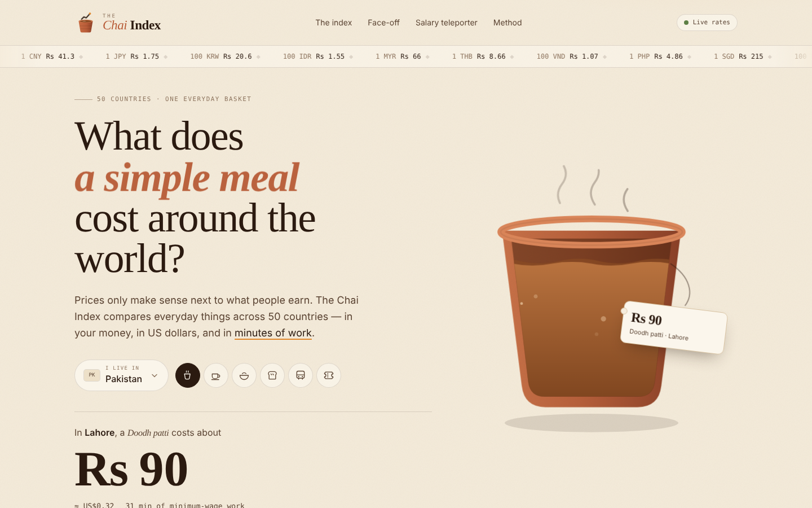
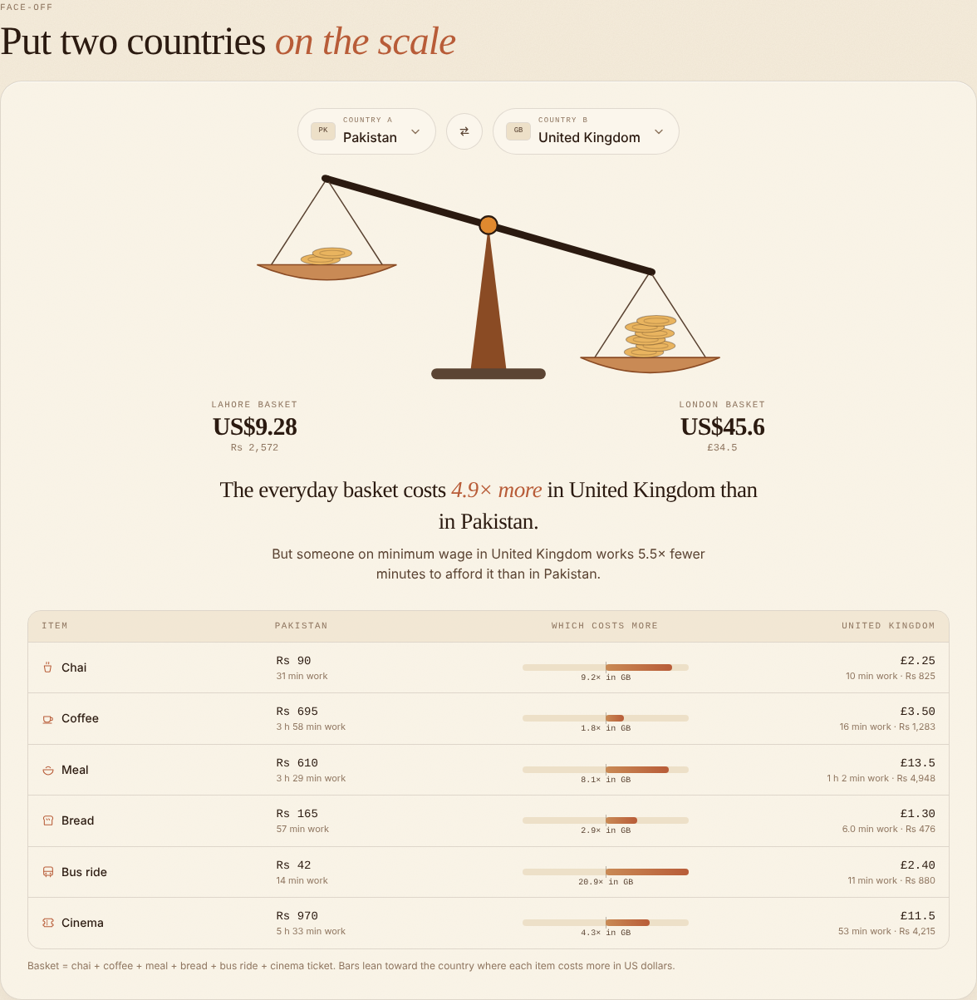
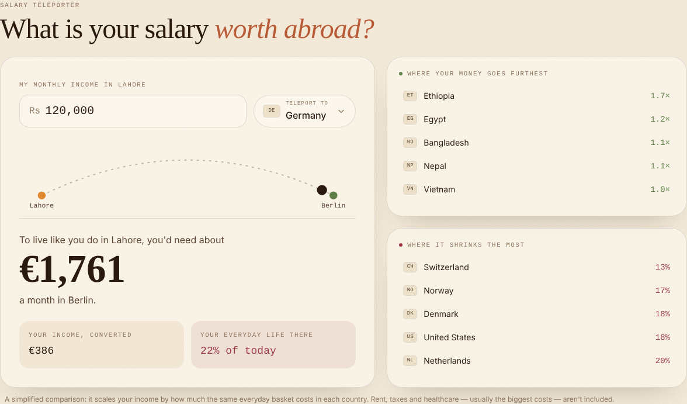

# The Chai Index ☕

**What does a cup of chai cost around the world — in your money, and in minutes of work?**

The Chai Index compares everyday prices across **50 countries**: a cup of the local tea, a cappuccino, a simple local meal, a loaf of bread, a bus ride and a cinema ticket. Prices are converted with **live exchange rates**, and — because a price only means something next to what people earn — every item is also shown as **minutes of minimum-wage work**.



🔗 **Live demo:** _add your Vercel link here_

---

## Features

**☕ The Index** — rank all 50 countries for any item
- Three ways to measure: **in your own currency**, **in US dollars**, or **in minutes of work**
- Filter by region (Asia, Middle East, Africa, Europe, Americas, Oceania) and flip between highest-first and lowest-first
- Rows glide to their new positions when you change anything (FLIP animation)
- Bars are "brewed" — lighter milk tea for cheap, strong dark tea for expensive
- Local names everywhere: *doodh patti* in Pakistan, *teh tarik* in Malaysia, *çay* in Türkiye, *karak* in the UAE, biryani, ramen, pho, tacos al pastor…
- "One hour of work buys ≈ N cups of chai" for every country

**⚖️ Face-off** — put two countries on a balance scale
- The beam tips toward the pricier country with a springy animation
- Item-by-item comparison with prices, minutes of work and a leaning bar for each item
- One-line verdict, e.g. *"The basket costs 4.9× more in the UK — but a UK minimum-wage worker earns it 5.5× faster."*

**✈️ Salary teleporter** — what is your income worth abroad?
- Enter your monthly income and pick a destination
- See how much you'd need there to keep the same everyday life, and how far your income goes if converted
- Lists where your money goes furthest and where it shrinks most

**Also**
- Custom logo: a clay kulhad whose steam rises as a little index chart
- Hero illustration where chai pours into the kulhad, the level rises with a moving wave, bubbles float and steam curls — and it re-pours when you change country or item
- Rolling odometer numbers, a scrolling live exchange-rate ticker, scroll-reveal sections
- Shareable links (`?home=pk&item=chai`), responsive down to small phones, keyboard-friendly pickers, respects reduced motion

| Face-off | Salary teleporter |
| --- | --- |
|  |  |

## Tech stack

| Area | Tools |
| --- | --- |
| Framework | [Next.js 16](https://nextjs.org/) (App Router) + React 19 |
| Language | TypeScript (strict) |
| Styling | Tailwind CSS v4 |
| Graphics & animation | Hand-built SVG + CSS animations + Web Animations API — no animation or chart libraries |
| Hosting | Vercel |

## Data

- **Exchange rates:** [ExchangeRate-API](https://www.exchangerate-api.com/) open access endpoint — free, no API key, updated daily. If it can't be reached, the app falls back to built-in rates.
- **Flags:** [flagcdn.com](https://flagcdn.com/) by Flagpedia.
- **Prices and minimum wages:** stored in [`lib/countries.ts`](lib/countries.ts), in each country's own currency. They are **indicative estimates** for one major city per country, compiled for this project — not official statistics. Real prices vary a lot by neighbourhood and venue. Countries with no national minimum wage (e.g. Singapore, UAE, Saudi Arabia, Italy, Switzerland, the Nordics) are shown separately in the minutes-of-work view.

Want to correct a price? Edit the number in `lib/countries.ts` and the whole site updates.

## Run it locally

You need [Node.js](https://nodejs.org/) 20 or newer.

```bash
npm install
npm run dev
```

Open http://localhost:3000.

## Deploy to Vercel

1. Push this project to a GitHub repository.
2. Go to [vercel.com/new](https://vercel.com/new) and import the repository.
3. Keep the defaults (Framework preset: **Next.js**) and click **Deploy**.

No environment variables needed.

## Project structure

```
app/
  layout.tsx          Fonts, metadata, favicon
  page.tsx            Page state (home country, item, measure), live rates, layout
  globals.css         Theme tokens + all animations (steam, waves, pour, ticker, odometer, scale)
components/
  Logo.tsx            Kulhad logo with chart-shaped steam
  Hero.tsx            Rotating headline, country + item pickers, odometer price
  Kulhad.tsx          The pouring-chai illustration
  RateTicker.tsx      Scrolling exchange-rate strip
  Ranking.tsx         The 50-country index with FLIP animation
  FaceOff.tsx         Two-country balance scale + item comparison
  Teleporter.tsx      Salary teleporter
  CountryPicker.tsx   Searchable country dropdown
  Odometer.tsx        Rolling digits
  Flag.tsx, ItemIcon.tsx, Reveal.tsx
lib/
  countries.ts        The 50-country dataset + fallback rates
  calc.ts             Conversion, minutes of work, basket, purchasing power, formatting
  items.ts            The six basket items
  rates.ts            Live exchange-rate fetch
  types.ts            Shared types
```

## Author

Designed & built by **Arooj Dogar** — [GitHub](https://github.com/AroojDogar)
